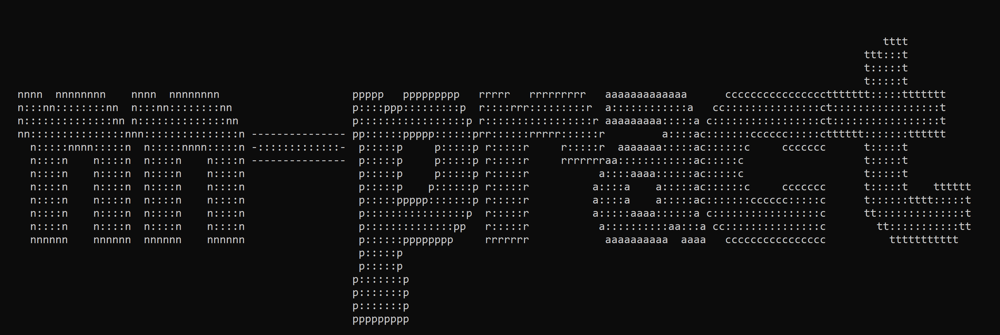

# nn-pract



A collective culmination of Andrej Karparthy's (<3) makemore lectures from value nodes to transformers. This repository serves as a bank of projects all in one place and to show applications of these modern neural network architectures.

Current implementations:

* Atomic MLP using autograd value nodes on MNIST, following [Bengio et al. 2003](https://www.jmlr.org/papers/volume3/bengio03a/bengio03a.pdf)
* Dilated Casual Convultions to generated names, following [Deepmind Wavenet 2016](https://arxiv.org/pdf/1609.03499)
* Transformers to generate text, following [Vaswani et al. 2017](https://arxiv.org/pdf/1706.03762)
* DiT to generate images, following [Ho et al. 2020](https://arxiv.org/pdf/2006.11239) and [Peebles et al. 2022](https://arxiv.org/pdf/2212.09748) (in prog. . .)

## Getting Started

### Setup

nn-pract uses [pip](https://pip.pypa.io/en/stable/) for depency management. To install all of
the following depencies, run the following:

```bash
pip install torch matplotlib numpy
```

## File Structure

```text
.
│   .gitignore
│   banner.png
│   microgpt.py
│   README.md
│   
├───diffusion           # Reversing Gaussian Noise using Diffusion Transformers
├───micrograd           # Identifying numbers from MNIST using pure nodes.
│   ├───code
│   │   ├───data
│   │   ├───model
│   │   └───nnlib
│   ├───paper           # My thoughts and process.
│   │   ├───Images
│   │   ├───Misc
│   │   └───Sections
│   └───thoughts
│       ├───Chapters
│       └───Images
├───transformer         # Generating text using Transformers.
│   └───drafts
└───wavenet             # Generating names using Dilated Casual Convolution .
    ├───data
    ├───drafts
    └───scripts
```

## License

GNU GPL