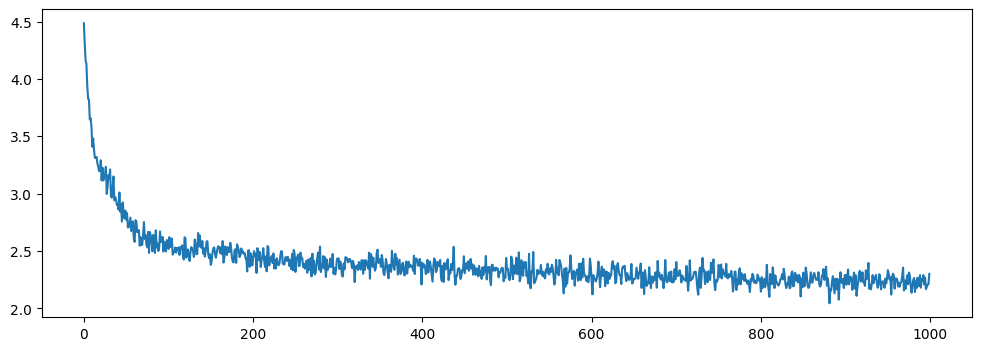

# Transformers (GPT1)
> https://arxiv.org/pdf/1706.03762

Using weighted aggregation to create interconnected connections between words. Masked for autoregressive behavior.

$ \text{Attention} = \text{softmax}\left(\frac{QK^{T}}{\sqrt{d_{k}}}\right)V $

$\text{MultiHead}(Q, K, V) = \text{Attention}(QW_{i}^{Q}, KW_{i}^{K}, VW_{i}^{V})$

Used on Shakespeare `input.txt` with the following hyper parameters:

* AdamW Optimizer
* $lr = 8 \cdot 10^{-4}$
* $blocksize = 8$
* $n_{embed} = 16$
* $n_{head size} = 40$
* $n_{layer} = 10$




```text
BENVOLIO:
To all you to you.

MERCUTIO:
To-monifore he's cannot you blust up her-many by and shall thou 'not under makenan thy famous't pur vich must clas.

Service, deatanant the feelings as angue.

KING HENRONGHASS HENR:
The his king, a littrent; thou mad't son to my or into the know like Rorting to sit grastan sat sabsir adrest the pouson,
'Tis now Worth Of villed hithers:
Be, stand bmom you,
Whithan then, margune hasttrickent sconford, offfence molied once you to o pardon that
O! death. When come ow'stakaubliotion's swear,
Leds theref, on it Varrying as a do same amence restter:
The kin inting too servagon were I do verivain nom from, He'll barnainior or child thus s
```