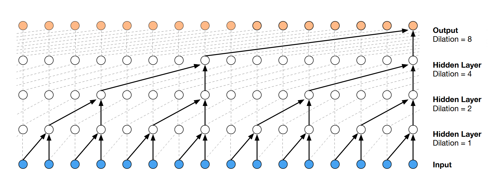
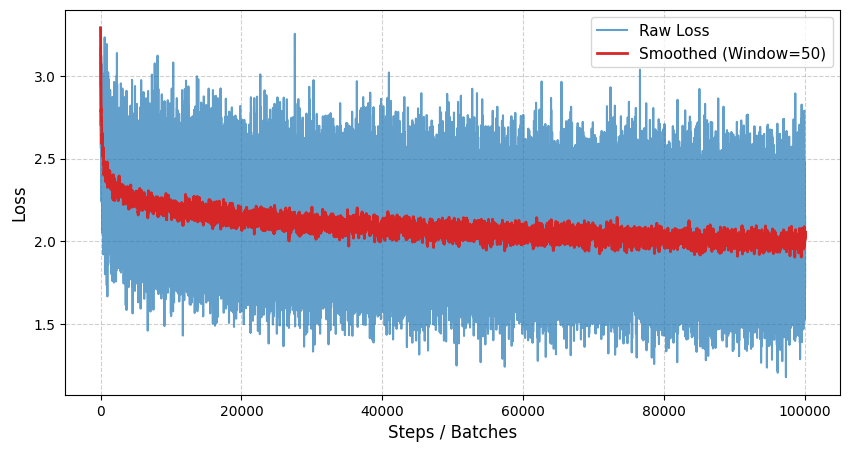

# Wavenet implementation
> https://arxiv.org/pdf/1609.03499

An autoregressive character-level predictor using wavenet embedding to "convolutionize" parts of context length to generate expected logits of next characters. Instead of the initial implementation of a single embedding layer of dimension N, we slowly crush and divide in multiple iterations.


> Dilated Causal Convolution

Used on `names.txt` with the following hyper parameters:

* AdamW Optimizer
* $lr = 4 \cdot 10^{-4}$
* $blocksize = 16$
* $n_{flattens} = 4$
* $n_{embed} = 32$
* $n_{hidden} = 64$



```
farzie.
delynn.
ossy.
alana.
pace.
```